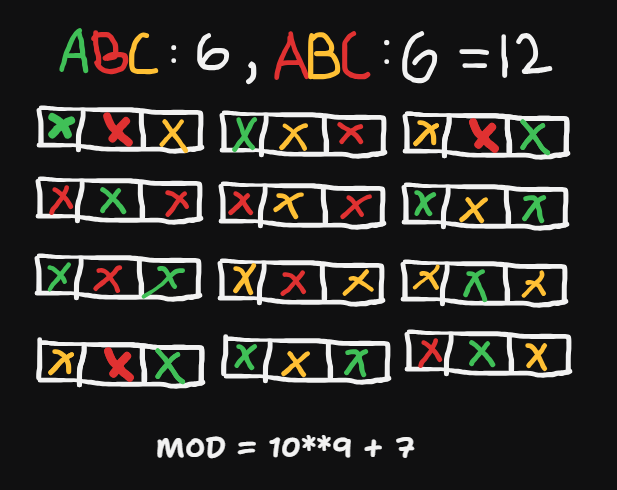

## About the Problem

**Problem Name**   : Number of Ways to Paint N × 3 Grid

**LeetCode ID**    : 1411

**Difficulty**     : Hard

## Example
    Input:  n = 1
    Output: 12

    Input:  n = 2
    Output: 54

## Algorithm (DP):
----------
1. Initialize two variables:
    a = 6 → number of valid colorings of type abc
    b = 6 → number of valid colorings of type aba
2. Traverse each row from 2 to n:
    a = 3*a + 2*b
    b = 2*a + 2*b
3. Take modulo 10^9 + 7
4. Return (a + b) % (10^9 + 7)

---

## Working

---

## Complexity

Time Complexity:
O(n) – one pass through rows

Space Complexity:
O(1) – constant space

## Submission
