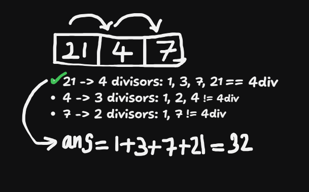

## About the Problem

**Problem Name**   : Four Divisors

**LeetCode ID**    : 1390 

**Difficulty**     : Medium

## Example
    Input: nums = [21,4,7]
    Output: 32
    Explanation: 
    21 has 4 divisors: 1, 3, 7, 21
    4 has 3 divisors: 1, 2, 4
    7 has 2 divisors: 1, 7
    The answer is the sum of divisors of 21 only.
    
## Algorithm
1. Traverse through element
2. Find the divisor of them by square root of a number
3. if the divisor is 4 return the sum of divisor
4. otherwise return 0

---

## Working

---

## Complexity

Time Complexity:
O(n) – traversal of arrays

Space Complexity:
O(n) – extra set is used

## Submission
