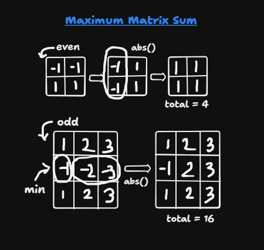
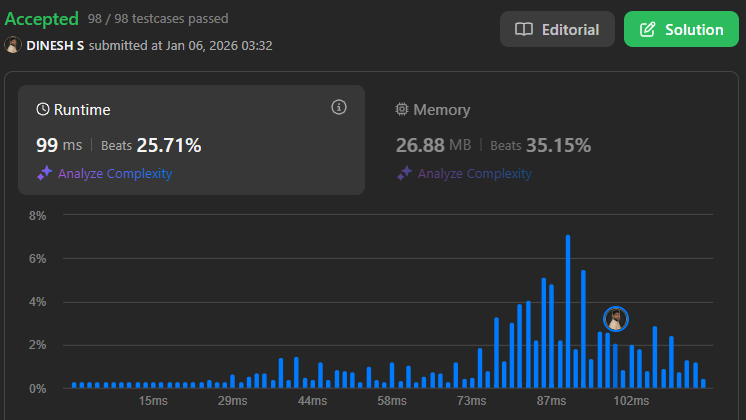

## About the Problem

**Problem Name**   : Maximum Matrix Sum

**LeetCode ID**    : 1975

**Difficulty**     : Medium

## Example
    Input: matrix = [[1,-1],[-1,1]]
    Output: 4
    Explanation: We can follow the following steps to reach sum equals 4:
    - Multiply the 2 elements in the first row by -1.
    - Multiply the 2 elements in the first column by -1.

## Algorithm
1. Initialize the trackers(neg count, total sum, min abs)
2. Track the smallest absolute value, and count the number of negative elements
3. Traverse through each element in the matrix
    - Add the absolute value of val to totalSum
    - If val is negative -> negativeCount ++
    - minAbsVal -> smaller of minAbsVal and abs(val)
4. After traversing the matrix check "-ve" counts:
    - odd: subtract 2 * minAbsVal from totalSum
    - even: Return totalSum

---

## Working

---

## Complexity

Time Complexity:
O(n×m) – iterates through matrix

Space Complexity:
O(1) – Size of Matrix

## Submission
