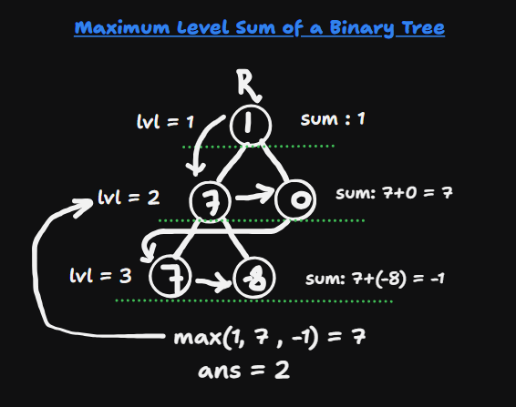
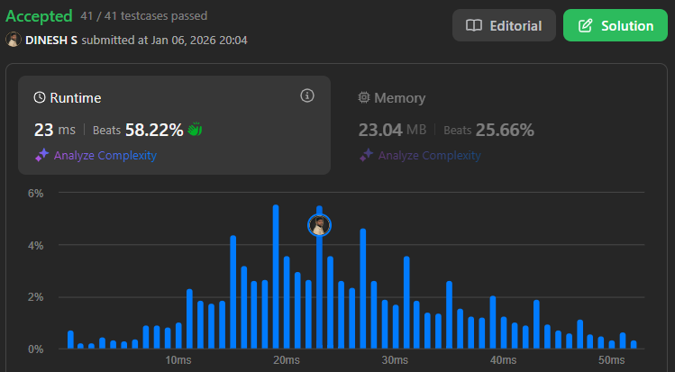

## About the Problem

**Problem Name**   : Maximum Level Sum of a Binary Tree

**LeetCode ID**    : 1161

**Difficulty**     : Medium

## Example
    Input: root = [1,7,0,7,-8,null,null]
    Output: 2
    Explanation: 
        Level 1 sum = 1.
        Level 2 sum = 7 + 0 = 7.
        Level 3 sum = 7 + -8 = -1.
        So we return the level with the maximum sum which is level 2.

## Algorithm
1. Initialize a queue with the root node (BFS).
2. Set current_level = 1, max_sum = -∞, answer = 1.
3. While the queue is not empty:
    - Compute the number of nodes at the current level.
    - Sum the values of all nodes at this level.
    - Add their children to the queue.
    - If the current level sum is greater than max_sum, update max_sum and answer.
    - Increment the level counter.
4. Return answer.

---

## Working

---

## Complexity

Time Complexity:
O(n) – queue operation

Space Complexity:
O(n) – BFS queue stores the nodes

## Submission
