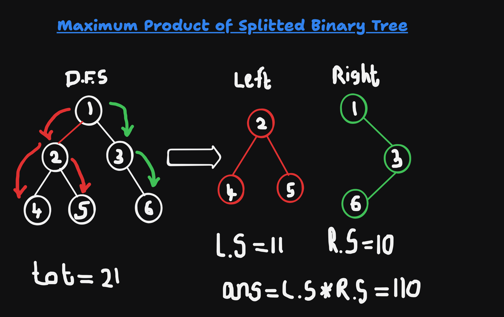
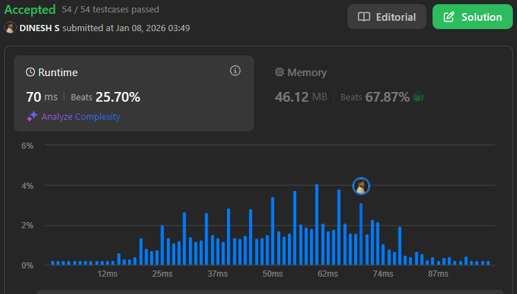

## About the Problem

**Problem Name**   : Maximum Product of Splitted Binary Tree

**LeetCode ID**    : 1339

**Difficulty**     : Medium

## Example
    Input: root = [1,null,2,3,4,null,null,5,6]
    Output: 90
    Explanation: Remove the red edge and get 2 binary trees with sum 15 and 6.Their product is 90 (15*6)

## Algorithm
1. Perform a DFS to compute the total sum of all nodes in the tree.
2. Perform another DFS to compute the subtree sum for every node.
3. For each subtree with sum subSum, consider splitting the tree at that node:
   - Product = subSum × (totalSum − subSum)
4. Track the maximum product obtained from all possible splits.
5. Return the maximum product modulo 10^9 + 7.

---

## Working

---

## Complexity

Time Complexity:
O(n) - Each node is visited twice

Space Complexity:
O(n) – Recursion stack

---

## Submission
