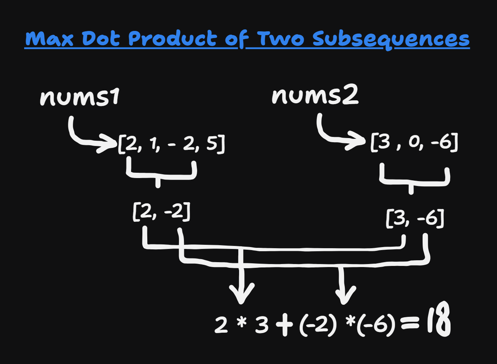
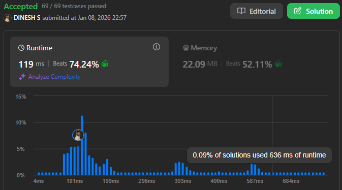

## About the Problem

**Problem Name**   : Max Dot Product of Two Subsequences

**LeetCode ID**    : 1458

**Difficulty**     : Hard

## Example
    Input: nums1 = [2,1,-2,5], nums2 = [3,0,-6]
    Output: 18
    Explanation: Take subsequence [2,-2] from nums1 and subsequence [3,-6] from nums2.
    Their dot product is (2*3 + (-2)*(-6)) = 18.

## Algorithm
1. Use DP where dp[i][j] is the maximum dot product using non-empty subsequences from nums1[0..i-1] and nums2[0..j-1].
2. For each (i, j), compute:

   * Take both elements: nums1[i-1] * nums2[j-1] + max(0, dp[i-1][j-1])
   * Skip element from nums1: dp[i-1][j]
   * Skip element from nums2: dp[i][j-1]
3. Set dp[i][j] to the maximum of the above.
4. Return dp[m][n].

---

## Working

---

## Complexity

Time Complexity:
O(m × n) – DP over both arrays

Space Complexity:
O(m × n) – DP table storage

## Submission

