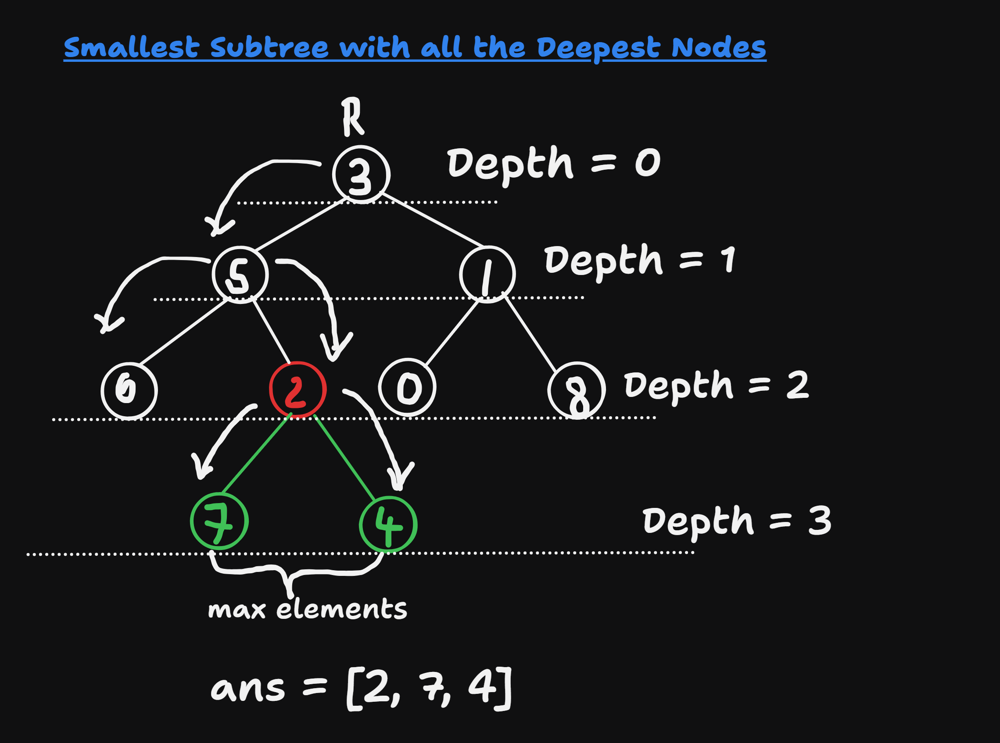

## About the Problem

**Problem Name**   : Smallest Subtree with all the Deepest Nodes  

**LeetCode ID**    : 865

**Difficulty**     : Medium

## Example
    Input: root = [1]
    Output: [1]
    Explanation: The root is the deepest node in the tree.

## Algorithm
1. Find the depth of every nodes
2. Find the answer with the help of depth
    - node is deepest of depth -> candiate
    - both children is candidate -> parent is answer

---

## Working

---

## Complexity

Time Complexity:
O(N) - traverse every node

Space Complexity:
O(H) - height of the tree

## Submission

