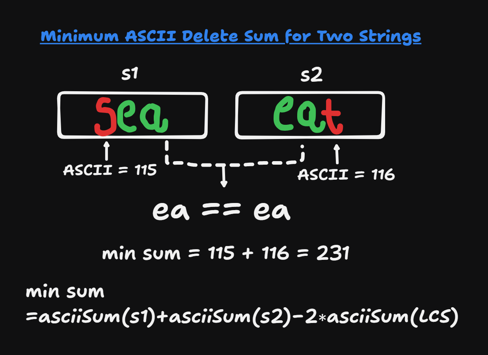
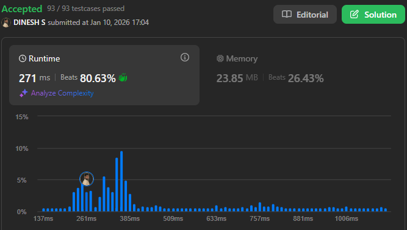

## About the Problem

**Problem Name**   : <PROBLEM_NAME>  
**LeetCode ID**    : <PROBLEM_ID>  
**Difficulty**     : <Easy / Medium / Hard>

## Example
Input: <input_example>

Output: <output_example>

## Algorithm
1. <Step 1>
2. <Step 2>
3. <Step 3>
4. <Step 4>

---

## Working

<!--  -->

---

## Complexity

Time Complexity:
O(n) – traversal of arrays

Space Complexity:
O(n) – extra set is used

## Submission
<!--  -->