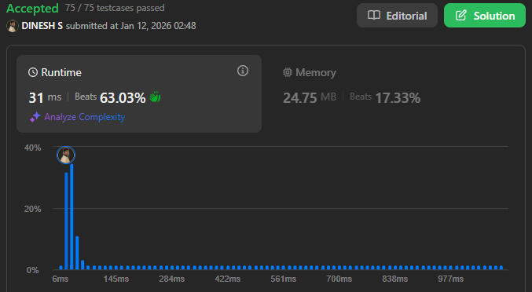

## About the Problem

**Problem Name**   : Maximal Rectangle 

**LeetCode ID**    : 85  

**Difficulty**     : Hard

## Example
    Input: matrix = [["1","0","1","0","0"],["1","0","1","1","1"],["1","1","1","1","1"],["1","0","0","1","0"]]
    Output: 6

## Algorithm
1. make each row of -> base of a histogram.
2. Maintain an array height where each column stores the number of consecutive '1's above it.
3. For each row:
    - Update the height array.
    - Find the largest rectangle area in the histogram using a stack.
4. Keep updating the maximum area.
5. Return the maximum area.

---

## Working

---

## Complexity

Time Complexity:
O(N x M) – Traversal x pushed/popped from the stack 

Space Complexity:
O(M) – No of Columns

## Submission
