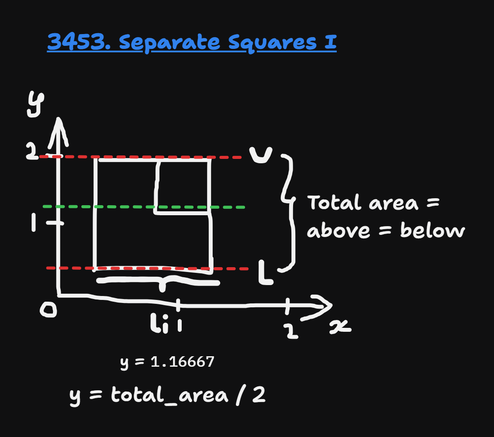

## About the Problem

**Problem Name**   : Separate Squares II

**LeetCode ID**    : 3454 

**Difficulty**     : Hard

---

## Example
    Input: points = [[1,1],[3,4],[-1,0]]
    Output: 7
    Explanation: One optimal path is [1,1] -> [2,2] -> [3,3] -> [3,4] -> [2,3] -> [1,2] -> [0,1] -> [-1,0]   
    Time from [1,1] to [3,4] = 3 seconds 
    Time from [3,4] to [-1,0] = 4 seconds
    Total time = 7 seconds
---

## Algorithm
1. Start from the last point in the list(x1, y1).
2. Repeatedly move to the next point(x2, y2).
3. For each move from (x1, y1) to (x2, y2):
    - The minimum time required is: max(|x2 - x1|, |y2 - y1|)
4. Accumulate and Return the total time.
---

## Working

---

## Complexity

Time Complexity: O(n) - Traversal through points

Space Complexity: O(1) - Constant

---

## Submission

---