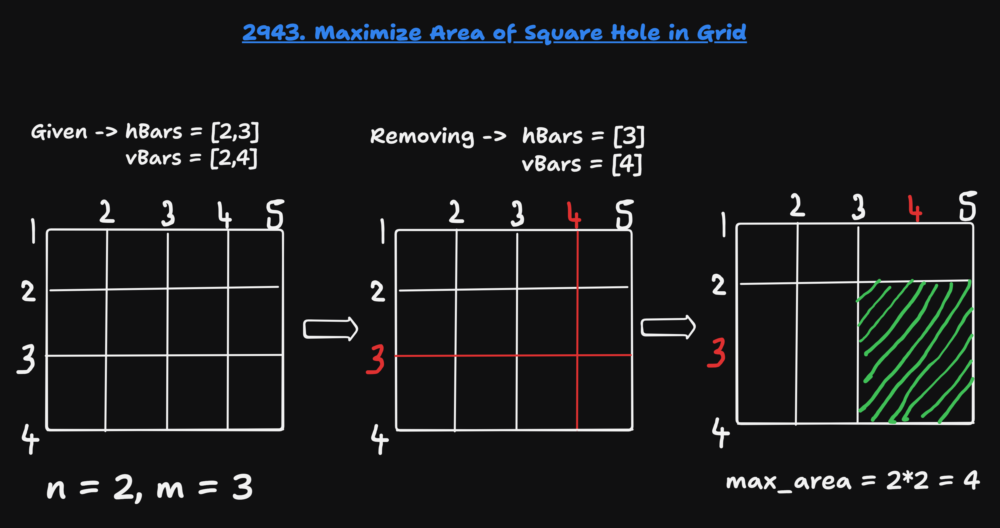

## About the Problem

**Problem Name**   : Maximize Area of Square Hole in Grid

**LeetCode ID**    : 2943 

**Difficulty**     : Medium

---

## Example
    Input: n = 2, m = 1, hBars = [2,3], vBars = [2]
    Output: 4
    Explanation:
    The left image shows the initial grid formed by the bars. The horizontal bars are [1,2,3,4], and the vertical bars are [1,2,3].
    One way to get the maximum square-shaped hole is by removing horizontal bar 2 and vertical bar 2.
---

## Algorithm
1. Sort the horizontal bars and vertical bars.
2. For each bar list:
   - Find the maximum length of consecutive values.
3. Take the minimum of the two maximum lengths as the square side.
4. Return the square of the side length.
---

## Working

---

## Complexity

Time Complexity: O(n log n) - Sorting

Space Complexity: O(1) - Constant

---

## Submission

---