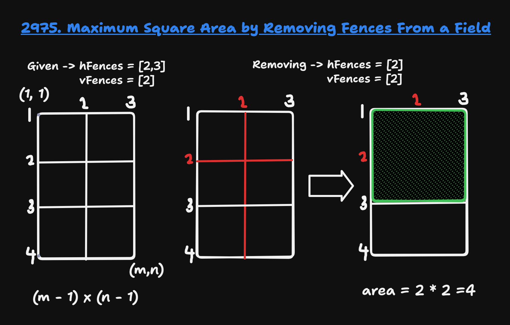

## About the Problem

**Problem Name**   : Maximum Square Area by Removing Fences From a Field

**LeetCode ID**    : 2975

**Difficulty**     : Medium

---

## Example
    Input: m = 4, n = 3, hFences = [2,3], vFences = [2]
    Output: 4
    Explanation: Removing the horizontal fence at 2 and the vertical fence at 2 will give a square field of area 4.4.
---

## Algorithm
1. Add the field boundaries to hfence(1->m) and vfence(1->n).
2. Calc all possible distances between pairs of horizontal fences and store them in a set.
3. Compute all possible distances between pairs of vertical fences.
4. Find the largest distance that appears in both horizontal and vertical distance sets.
5. If no common distance -> -1; o.w -> square area
---

## Working

---

## Complexity

Time Complexity:
O(H^2 + V^2) - Iterating through pairs of fences

Space Complexity:
Space: O(H^2) - Hash set

---

## Submission

---