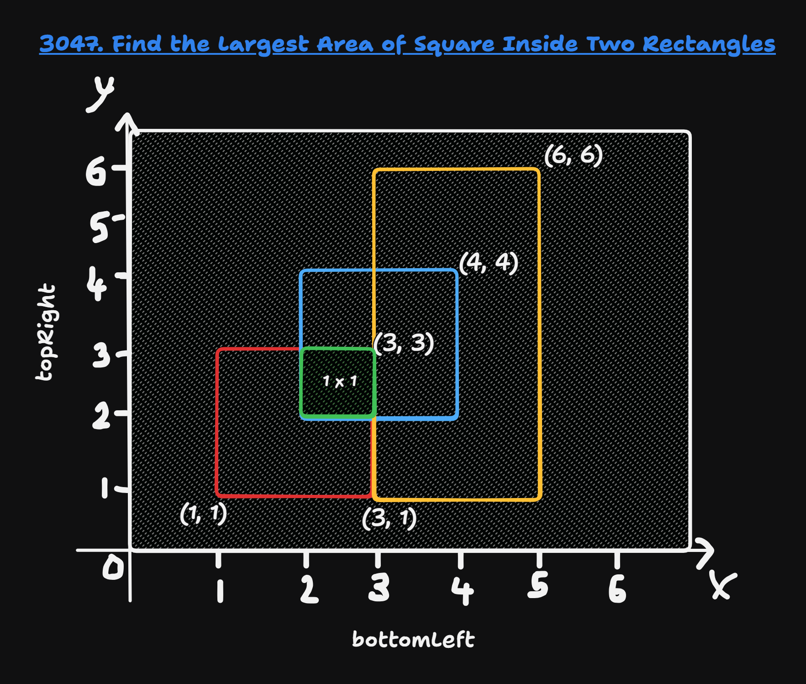
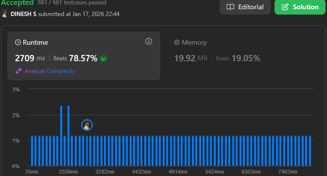

## About the Problem

**Problem Name**   : Find the Largest Area of Square Inside Two Rectangles

**LeetCode ID**    : 3047

**Difficulty**     : Medium

---

## Example
    Input: bottomLeft = [[1,1],[2,2],[3,1]], topRight = [[3,3],[4,4],[6,6]]
    Output: 1
    Explanation:
    A square with side length 1 can fit inside either the intersecting region of rectangles 0 and 1 or the intersecting region of rectangles 1 and 2. Hence the maximum area is 1. It can be shown that a square with a greater side length can not fit inside any intersecting region of two rectangles.

---

## Algorithm
1. For each rectangle pair(s), find overlapping area of them.
2. Then, take the smaller of width or height as the square side.
3. Keep the maximum side found.
4. Return side².

---

## Working

---

## Complexity

Time Complexity:
O(n^2) - Nested Loop

Space Complexity:
O(n) – Constant

---

## Submission

---