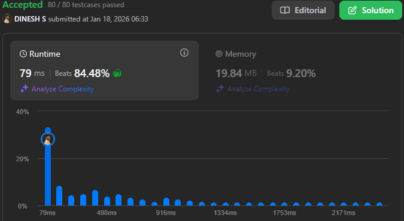

## About the Problem

**Problem Name**   : Largest Magic Square

**LeetCode ID**    : 1895

**Difficulty**     : Medium

---

## Example
    Input: grid = [[7,1,4,5,6],[2,5,1,6,4],[1,5,4,3,2],[1,2,7,3,4]]
    Output: 3
    Explanation: The largest magic square has a size of 3.
    Every row sum, column sum, and diagonal sum of this magic square is equal to 12.
    - Row sums: 5+1+6 = 5+4+3 = 2+7+3 = 12
    - Column sums: 5+5+2 = 1+4+7 = 6+3+3 = 12
    - Diagonal sums: 5+4+3 = 6+4+2 = 12

---

## Algorithm
1. Precompute prefix sums for rows, columns, and both diagonals.
2. Try square sizes from largest to smallest.
3. For each position, check:
    - All row sums
    - All column sums
    - Both diagonal sums
4. If all sums are equal -> square size. ow -> 1

---

## Working

---

## Complexity

Time Complexity:
O(min(m,n) × m × n)

Space Complexity:
 O(m × n) - prefix sum tables

---

## Submission

---