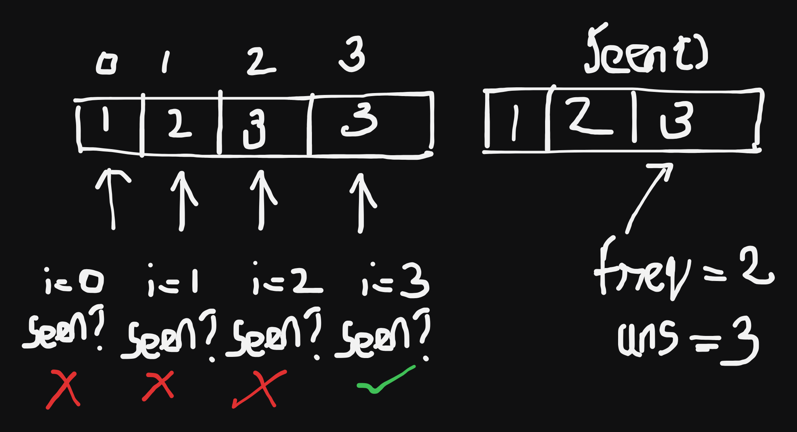

## About the Problem

**Problem Name**   : Contains Duplicate

**LeetCode ID**    : 217  

**Difficulty**     : Easy

## Example
    Input: nums = [1,2,3,1]
    Output: true
    Explanation:
    The element 1 occurs at the indices 0 and 3.

## Algorithm
1. Type cast the array as set for visited val
2. Traverse through the list of elements
3. if the value is seen? -> return True
4. otherwise -> add the elements in set

---

## Working

---

## Complexity

Time Complexity:
O(n) – single traversal

Space Complexity:
O(n) – extra set is used to store visited elements
